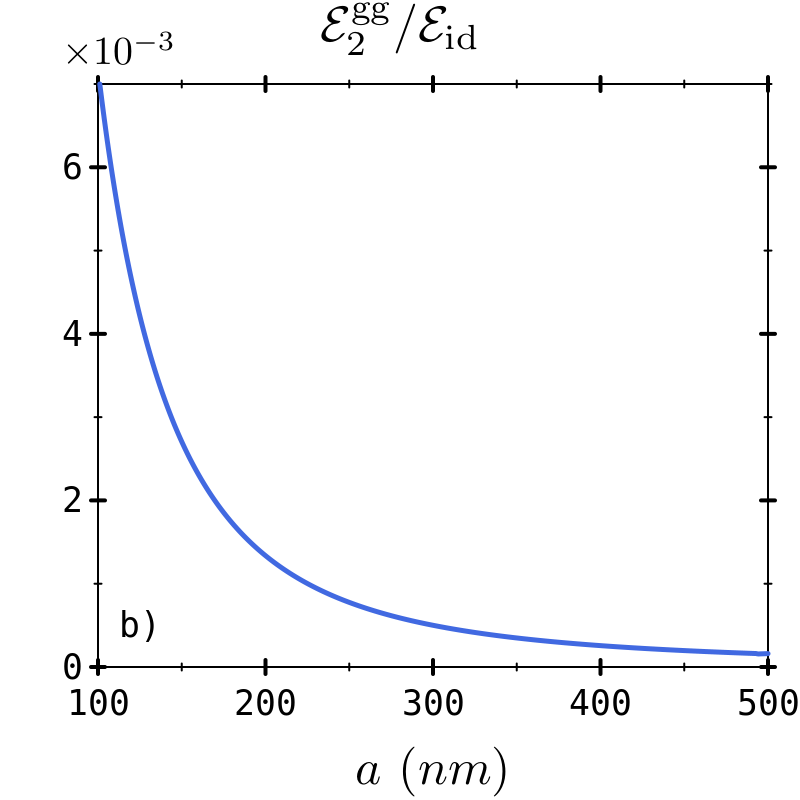

# f2

Description here




```scheme
#lang racket
(require plot latex-pict pict)                    ; to use latex
(require (prefix-in jp: metapict))                ; to save in different formats
;(require metapict/save-pdf)                      ; to save plot as pdf by using save-pict-as-pdf
;(require metapict/save-svg)                      ; to save plot as svg by using save-pict-as-svg
(require simple-polynomial/private/poly-smooth)   ; to make specific splines
(require simple-polynomial/fit)                   ; to make simple splines
(current-directory (current-directory))           ; the current directory is the directory of rkt file 
;(current-directory "/path/to/directory")         ; for specific directory 
(define F2 (call-with-input-file* "F2.txt"
  (λ (in)
    (for/list ([l (in-lines in)])
       (map string->number (string-split l))))))  ; F2.txt contains two column of number separated by space - x y.
                                                  ; F2 contains the same numbers but pared like (x y)
                                                  ; to see F2 use (displayln F1)
;(define spF2 (points->spline-evaluator F2))      ; make smoothed data function for plot F2, simple spline
(define spF2
  (points->spline-evaluator
   ((make-least-squares-point-smoother 7 4 0) F2))); make smoothed data function for plot F2, regulated form of spline
(define nspF2 (lambda (x) (* (spF2 x) 1e3)))       ; the scale of numbers is 10^{-3}. One multiplies on 10^3 and put information
                                                   ; about this in upper of figure, outside of it: 10^{-3} 
;; fig is the main figure. Remember that nspF2 = 10^3 spF2
(define fig
  (parameterize
      [(plot-y-ticks (linear-ticks #:number 4)); Number of ticks in y axis
       (plot-line-width 4)                      ; width of axes
       (plot-font-size 26)                      ; font size for plot
       (plot-font-family 'modern)               ; all possibilies are here https://docs.racket-lang.org/draw/font_.html 
       (plot-tick-size 14)                      ; size of ticks
       (plot-background-alpha 0)                ; full transparancy is for 0
       (plot-x-far-axis? #t)                    ; #f - removes upper boundary of frame
       (plot-y-far-axis? #t)                    ; #f - removes right boundary of frame
                 ]
  (plot-pict
   (list                                        ; use list for more than single function to plot
    (function nspF2 100 500 #:color "Royal Blue" #:width 5); the first function to plot
    ; all colors names are here https://docs.racket-lang.org/draw/color-database___.html
    (point-label #(100 .5) "b)" #:point-size 0) ; second figure to plot is label b) at point (100 .5)
    )
    ; below are options to plot at whole
        #:title (tex-math "\\mathcal{E}^{\\mathrm{gg}}_2 /\\mathcal{E}_{\\mathrm{id}}" #:scale 5); title of figure
                                             ;; in the latex form. Use double backslash \\ instead of single one \ 
                                             ;; scale regulates size of fonts. \Large, \Huge does not work
        #:width 800 #:height 800                     ; size of plot
        #:y-min 0 #:y-max 7                          ; range for y axes
        #:y-label ""                                 ; there is no label at y axes
        #:x-label (tex-math "a\\ (nm)" #:scale 5)))  ; x label by using latex
  )                                                  
(define lab (tex-math "\\times 10^{-3}" #:scale 4))  ; lab is the text with scale factor which will put outside
(define res (lt-superimpose fig (inset lab 60 30)))  ; res is combination of fig and lab. position is (60 30)
(pict->bitmap res)                                   ; to show figure, pict->bitmap needs for correct latex representation
;(save-pict-as-pdf res "f2.pdf")                     ; to save plot as pdf with metapict/save-pdf
;(save-pict-as-svg res "f2.svg")                     ; to save plot as svg with metapict/save-svg
(jp:save-pict "f2.png" res 'png)                     ; to save plot in png, svg, pdf, xbm, xpm and bmp.
  ```
