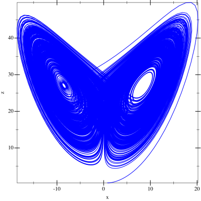

```scheme
#lang racket
(require (planet williams/science/ode-initval)
         plot)
 
(define (lorenz t y dy params)
  (let ((sigma (car params))
        (rho (second params))
        (beta (third params))
        (y0 (vector-ref y 0))
        (y1 (vector-ref y 1))
        (y2 (vector-ref y 2)))
    (vector-set! dy 0 (* sigma (- y1 y0)))
    (vector-set! dy 1 (- (* y0 (- rho y2)) y1))
    (vector-set! dy 2 (- (* y0 y1) (* beta y2)))))
 
(define (main sigma rho beta)
  (let* ((type rk4-ode-type)
         (step (make-ode-step type 3))
         (params (list sigma rho beta))
         (system (make-ode-system lorenz #f 3 params))
         (t 0.0)
         (t1 500.0)
         (h 0.01)
         (y (vector 1.0 0.0 0.5))
         (y-err (make-vector 3))
         (dydt-in (make-vector 3))
         (dydt-out (make-vector 3))
         (y0-values '())
         (y1-values '())
         (y2-values '()))
    (ode-system-function-eval system t y dydt-in)
    (let loop ()
      (when (< t t1)
        (ode-step-apply step t h
                        y y-err
                        dydt-in
                        dydt-out
                        system)
        (set! y0-values (cons (vector-ref y 0) y0-values))
        (set! y1-values (cons (vector-ref y 1) y1-values))
        (set! y2-values (cons (vector-ref y 2) y2-values))
        (vector-set! dydt-in 0 (vector-ref dydt-out 0))
        (vector-set! dydt-in 1 (vector-ref dydt-out 1))
        (vector-set! dydt-in 2 (vector-ref dydt-out 2))
        (set! t (+ t h))
        (loop)))
    (define x-z (plot (lines (map vector y0-values y2-values) #:color "blue")
          #:x-label "x"
          #:y-label "z"))
    x-z))

(main 10.0 28. (/ 8. 3.))
```
